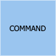

---
hide:
  - navigation
---
# Event Storming
## Introdução
### O que é Event Storming?
Event Storming é uma técnica de design rápido que engaja especialistas do domínio de negócios com desenvolvedores para que alcancem um ciclo rápido de aprendizagem (aprender o máximo possível no menor tempo possível), focando mais nos processos de negócio do que em abstrações técnicas (classes, entidades…)

**Principais vantagens**:

- **Rápido**: Event Storming reduz o tempo necessário para criar um modelo de domínio de negócios abrangente. Com esta técnica, você pode mapear um processo de negócios em horas durante um único workshop. Assim, em um dia você pode alcançar resultados que costumavam levar semanas.
- **Prático**: Event Storming resulta em um modelo totalmente comportamental que pode ser implementado e validado rapidamente. Em vez de levar a um processo abstrato de modelagem de dados, o Event Storming desenvolve uma compreensão compartilhada do problema que está sendo resolvido, descobrindo possíveis soluções de maneira rápida e eficaz.
- **Direto e simples**: Em vez de usar diagramas UML complexos, o Event Storming divide o processo em termos simples que os interessados ​​técnicos e não técnicos podem entender.
- **Cativante**: Event Storming é uma maneira divertida e envolvente de criar um modelo de domínio. Devido à abordagem prática, cada participante é convidado a compartilhar seu conhecimento sobre o domínio. Isso leva a uma grande interação e resulta em uma compreensão mais completa do processo.
- **Discussões**: Como todas as partes interessadas podem participar, o Event Storming é uma maneira ideal de iniciar uma discussão para descobrir lacunas, resolver o mal-entendido e desenvolver novas ideias e soluções. Ele reúne o poder de especialistas de domínio e especialistas técnicos e leva a um modelo rico e revolucionário do domínio.

### O que não é Event Storming?
Apesar de ter vários conceitos em comum com DDD (Domain Driven Design) e Event Sourcing, o Event Storming não é voltado apenas para desenvolvimento de software. A ideia é que todos os envolvidos participem, para gerar uma linguagem que possa ser usada tanto pelos desenvolvedores quanto pelos detentores do conhecimento de negócios.

No Event Storming não discutimos sobre implementação então, mais tarde, a equipe de desenvolvimento pode selecionar a melhor arquitetura de código necessária para obter os resultados esperados.

### Informações gerais
**Setup inicial**

1.  **Pessoas**: entre 6 a 10    
2.  **Preparação**: 20 min    
3.  **Tempo**: 3 a 6 hrs (é importante salientar que se tentarmos mapear o software todo de uma vez essa dinâmica pode demorar mais de 6hrs)    
4.  **Dificuldade**: alta
    
## Quem deve participar?

-   **Pessoas que sabem as perguntas**: Normalmente são pessoas técnicas com: Engenheiros de software, testes e etc.    
-   **Pessoas que sabem as respostas:** Normalmente são os especialistas de domínio, pessoas que trabalham dia a dia com esses desafios    
-   **Facilitador:** Scrum master, product owner ou arquiteto

## Terminologia
| Sticker | Descrição |
|-------|-----------|
|  | Os eventos são atividades que precisam acontecer dentro da nossa solução final. Isto quer dizer tanto as já existentes quanto novas no sistema proposto.   Por convenção, os eventos são conjugados no passado, como por exemplo: Proposta Criada, Apólice Emitida, Cadastro Criado, Pagamento Criado, Pagamento Finalizado, Usuário Cadastrado e etc. |
|  | Uma pessoa que executa um comando por meio de uma visão.|
|  | Comandos representam uma ação, interação ou decisão que leva ao evento com o qual está relacionado. Considere que é algo realizado por um usuário ou sistema externo. |
|  | As políticas indicam a decisão a ser tomada, que dispararão novos comandos e eventos. Ela é um processo de negócio no fluxo. |
|  | Sistemas externos pode ser qualquer coisa que o time não tenha controle. |
|  | Pode ser qualquer parte de uma interface do usuário ou registro de informações que o usuário precisa para tomar uma decisão ou executar uma ação. |
|  | As agregações são conjuntos de dados (Entidades e Value Objects) que estão relacionadas e que podemos ver como uma unidade.   Descrevemos as agregações usando um substantivo e as representamos com um sticky note no topo do fluxo e uma elipse delimitando os eventos, comandos e demais elementos que com ela se associam.|
|  | Tópicos obscuros ou duvidas que surgirem durante a sessão. |
|  | Representam os limites do sistema, agrupando agreggates e identificando como estes limites se comunicam. Podemos fazer uma analogia com os "módulos" de um sistema. "

## Flow

## Building blocks

## Etapas
Em nossas etapas vamos utilizar como exemplo o processo de pedido de um _e-commerce_.

### Preparação
Nesse momento é que devemos nos certificar qual área que iremos modelar/desenvolver (quanto mais extenso o processo de negócio, mais tempo a dinâmica leva)

### Descoberta dos eventos de domínio
Nesse momento levantamos todos o eventos que são importantes para o negócio (é importante que o verbo do eventos esteja no passado e que os eventos sigam uma ordem cronológica)

Basicamente, todos na sala estão escrevendo eventos. Devemos tratar essa fase como um brainstorming, portanto, devemos evitar aplicar qualquer análise ou filtragem nesta fase, pois isso apenas atrasará as coisas.

### Colocando os eventos em ordem
A segunda etapa, ajuda a identificar quaisquer eventos ausentes, colocando os eventos em sequência (geralmente da esquerda para a direita). Depois que a ordem for estabelecida, podemos retroceder para ajudar a identificar eventos adicionais.

Nessa etapa também é importante que os especialistas de domínio expliquem o que é cada um dos eventos mapeados. Dessa maneira, conseguimos unificar os sinônimos, aprimorar as diferenças e validar a ordem temporal.

Nota!: Eventos sinalizados com estrela, foram novos eventos identificaos ao refinar o fluxo.

### Modelando ecossistema mais amplo em torno dos eventos
Identificar causas (de onde vem os eventos de domínio). Existem quatro principais

1.  Ações do usuário  
2.  Sistemas externos    
3.  Tempo    
4.  Reações automáticas    

Nessa etapa fazemos perguntas como:

1.  O que desencadeou o evento? É um sistema? Um usuário? Outro evento?    
2.  Quais eventos acionam quais políticas?    
3.  Quais políticas chamam novos comandos?   

### Categorização simples dos eventos
Neste ponto, todos os eventos detalhados e suas partes relacionadas devem ser modelados e conforme você se prepara para passar para a categorização.

A primeira categorização é conhecida como agregados. Estes são os substantivos, ou as coisas, sobre as quais os eventos operam. O DDD também tem um conceito de entidades, que você pode considerar como o próximo nível abaixo dos agregados. Tratar o agregado e a entidade como o mesmo ajuda a simplificar as coisas, tornando mais fácil para as pessoas entenderem. No exemplo de processo de pedido, Inventário, Pedido, Oferta são todos exemplos de agregados. São as coisas sobre as quais os eventos estão operando.

### Categorização de eventos de contexto limitado
Agora estamos prontos para o nível de categorização de **contexto limitado .** Todos os eventos relacionados cairiam em um único contexto limitado. Por exemplo, todos os eventos relacionados a um carrinho de compras estariam dentro de um contexto limitado a um carrinho de compras. Um conceito importante de _microservice_ a ser lembrado aqui é que, se ele mudar junto, deve seguir junto.  Queremos eliminar ao máximo as dependências em contextos limitados. Se o idioma mudar entre os eventos, isso é um sinal de que você cruzou para um contexto limitado diferente.

### Definindo microservices
Nessa etapa usamos os contextos limitados e os agregados para entender os _microservices_ necessários. Normalmente, um agregado dentro de um contexto limitado representa um ou mais _microservices_.

Nesse exemplo, o contexto limitado do **pedido capturado** terá _microservices_ relacionados ao pedido e ao inventário. Podemos notar que o pedido também existe no contexto limitado do **carrinho** de compras e no contexto limitado do **atendimento de pedido**. Não há problema, pois indica que são _microservices_ diferentes, pois estão em diferentes contextos limitados. Ambos podem estar fazendo coisas relacionadas a um pedido, mas o que estão fazendo é diferente. Em um aplicativo monolítico, eles seriam agrupados criando acoplamento, mas com uma arquitetura de _microservices_, os separamos para independência.